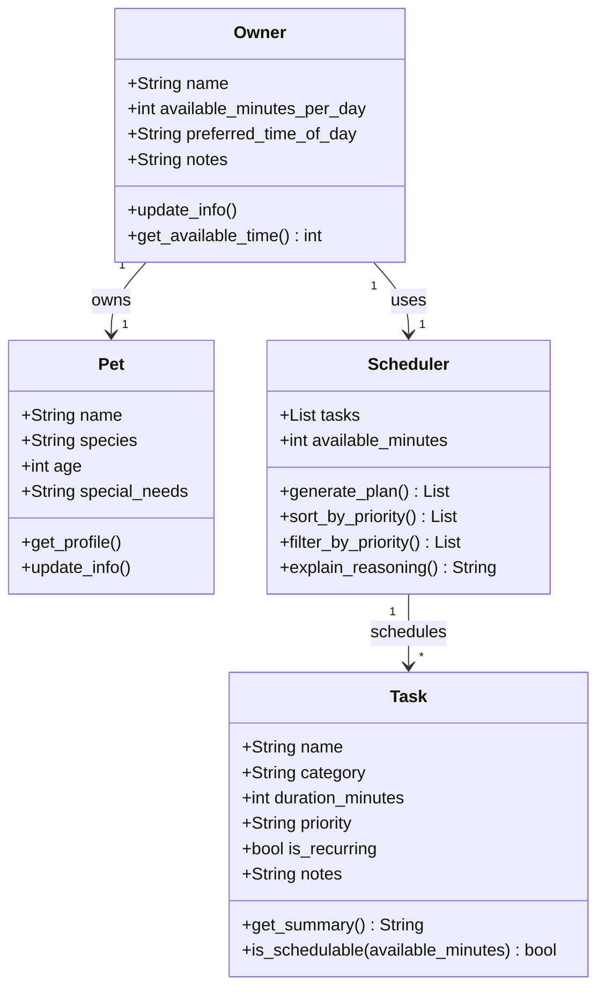

# PawPal+ Project Reflection

## 1. System Design

**a. Initial design**

- Briefly describe your initial UML design.
- What classes did you include, and what responsibilities did you assign to each?

**b. Design changes**

- Did your design change during implementation?
- If yes, describe at least one change and why you made it.

**c. Core user actions**

The three core actions a user should be able to perform in PawPal+:

1. **Enter owner and pet information** — The user provides basic profile details such as the pet's name, species, and owner preferences (e.g., available time per day, preferred care windows). This gives the scheduler the context it needs to personalize the plan.

2. **Add and manage care tasks** — The user creates and edits individual pet care tasks (walks, feeding, medication, grooming, enrichment, etc.), specifying at minimum a duration and a priority level. This task list is the input the scheduler reasons over.

3. **Generate and view a daily care plan** — The user triggers the scheduler to produce a prioritized daily schedule based on their tasks and constraints. The app displays the resulting plan and explains why tasks were ordered or omitted, so the owner understands the reasoning.

---

## 2. Scheduling Logic and Tradeoffs

**a. Constraints and priorities**

- What constraints does your scheduler consider (for example: time, priority, preferences)?
- How did you decide which constraints mattered most?

**b. Tradeoffs**

- Describe one tradeoff your scheduler makes.
- Why is that tradeoff reasonable for this scenario?

---

## 3. AI Collaboration

**a. How you used AI**

- How did you use AI tools during this project (for example: design brainstorming, debugging, refactoring)?
- What kinds of prompts or questions were most helpful?

**b. Judgment and verification**

- Describe one moment where you did not accept an AI suggestion as-is.
- How did you evaluate or verify what the AI suggested?

---

## 4. Testing and Verification

**a. What you tested**

- What behaviors did you test?
- Why were these tests important?

**b. Confidence**

- How confident are you that your scheduler works correctly?
- What edge cases would you test next if you had more time?

---

## 5. Reflection

**a. What went well**

- What part of this project are you most satisfied with?

**b. What you would improve**

- If you had another iteration, what would you improve or redesign?

**c. Key takeaway**

- What is one important thing you learned about designing systems or working with AI on this project?
