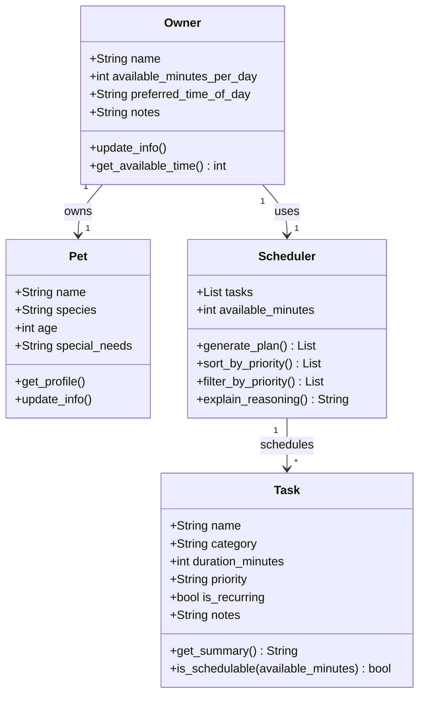

# PawPal+ Project Reflection

## 1. System Design

**a. Initial design**

- Briefly describe your initial UML design.
- What classes did you include, and what responsibilities did you assign to each?

The initial design includes four classes: `Owner`, `Pet`, `Task`, and `Scheduler`.

- `Owner` holds the pet owner's profile — their name, how many minutes per day they have available, their preferred time of day, and any notes. It is responsible for providing the time constraints the scheduler works within.
- `Pet` holds the pet's basic information — name, species, age, and any special needs. It represents who the care plan is being built for and provides context that could influence task priorities.
- `Task` represents a single care activity such as a walk, feeding, or medication. It holds the task name, category, duration, priority level, whether it recurs daily, and optional notes. It is responsible for describing what needs to be done and whether it can fit within available time.
- `Scheduler` is the core logic class. It takes a list of tasks and the owner's available minutes, then generates a prioritized daily plan. It is responsible for sorting and filtering tasks and explaining why certain tasks were included or skipped.

**b. Design changes**

- Did your design change during implementation?
- If yes, describe at least one change and why you made it.

Yes, four changes were made after reviewing the initial skeleton:

1. **Added a `Priority` enum** — `Task.priority` was originally a plain string, which meant nothing would stop invalid values like `"banana"` from being passed in, and sorting would be alphabetical rather than meaningful. Replacing it with a `Priority` enum (`HIGH=1`, `MEDIUM=2`, `LOW=3`) makes priority sorting correct and input safe.

2. **`Scheduler` now takes `Owner` and `Pet` instead of raw `available_minutes`** — the original design passed only an integer, losing all owner and pet context (e.g. `preferred_time_of_day`, `special_needs`). These details should influence the plan, so the full objects are passed in instead.

3. **Added `self.skipped` list to `Scheduler`** — `explain_reasoning()` had no data to work from. Without tracking which tasks were skipped and why during plan generation, the method could never produce a meaningful explanation. The `skipped` list gives it that state.

4. **Renamed `is_schedulable(available_minutes)` to use `remaining_minutes`** — the original parameter name implied checking against total daily time, but the correct check is against how many minutes are *left* after already-scheduled tasks are accounted for.

**c. Core user actions**

The three core actions a user should be able to perform in PawPal+:

1. **Enter owner and pet information** — The user provides basic profile details such as the pet's name, species, and owner preferences (e.g., available time per day, preferred care windows). This gives the scheduler the context it needs to personalize the plan.

2. **Add and manage care tasks** — The user creates and edits individual pet care tasks (walks, feeding, medication, grooming, enrichment, etc.), specifying at minimum a duration and a priority level. This task list is the input the scheduler reasons over.

3. **Generate and view a daily care plan** — The user triggers the scheduler to produce a prioritized daily schedule based on their tasks and constraints. The app displays the resulting plan and explains why tasks were ordered or omitted, so the owner understands the reasoning.

---

## 2. Scheduling Logic and Tradeoffs

**a. Constraints and priorities**

- What constraints does your scheduler consider (for example: time, priority, preferences)?
- How did you decide which constraints mattered most?

**b. Tradeoffs**

- Describe one tradeoff your scheduler makes.
- Why is that tradeoff reasonable for this scenario?

---

## 3. AI Collaboration

**a. How you used AI**

- How did you use AI tools during this project (for example: design brainstorming, debugging, refactoring)?
- What kinds of prompts or questions were most helpful?

**b. Judgment and verification**

- Describe one moment where you did not accept an AI suggestion as-is.
- How did you evaluate or verify what the AI suggested?

---

## 4. Testing and Verification

**a. What you tested**

- What behaviors did you test?
- Why were these tests important?

**b. Confidence**

- How confident are you that your scheduler works correctly?
- What edge cases would you test next if you had more time?

---

## 5. Reflection

**a. What went well**

- What part of this project are you most satisfied with?

**b. What you would improve**

- If you had another iteration, what would you improve or redesign?

**c. Key takeaway**

- What is one important thing you learned about designing systems or working with AI on this project?
