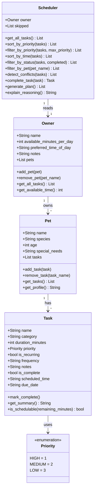

# PawPal+ Project Reflection

## 1. System Design

**a. Initial design**

- Briefly describe your initial UML design.
- What classes did you include, and what responsibilities did you assign to each?

The initial design includes four classes: `Owner`, `Pet`, `Task`, and `Scheduler`.

- `Owner` holds the pet owner's profile — their name, how many minutes per day they have available, their preferred time of day, and any notes. It is responsible for providing the time constraints the scheduler works within.
- `Pet` holds the pet's basic information — name, species, age, and any special needs. It represents who the care plan is being built for and provides context that could influence task priorities.
- `Task` represents a single care activity such as a walk, feeding, or medication. It holds the task name, category, duration, priority level, whether it recurs daily, and optional notes. It is responsible for describing what needs to be done and whether it can fit within available time.
- `Scheduler` is the core logic class. It takes a list of tasks and the owner's available minutes, then generates a prioritized daily plan. It is responsible for sorting and filtering tasks and explaining why certain tasks were included or skipped.



**b. Design changes**

- Did your design change during implementation?
- If yes, describe at least one change and why you made it.

Yes, four changes were made after reviewing the initial skeleton:

1. **Added a `Priority` enum** — `Task.priority` was originally a plain string, which meant nothing would stop invalid values like `"banana"` from being passed in, and sorting would be alphabetical rather than meaningful. Replacing it with a `Priority` enum (`HIGH=1`, `MEDIUM=2`, `LOW=3`) makes priority sorting correct and input safe.

2. **`Scheduler` now takes `Owner` and `Pet` instead of raw `available_minutes`** — the original design passed only an integer, losing all owner and pet context (e.g. `preferred_time_of_day`, `special_needs`). These details should influence the plan, so the full objects are passed in instead.

3. **Added `self.skipped` list to `Scheduler`** — `explain_reasoning()` had no data to work from. Without tracking which tasks were skipped and why during plan generation, the method could never produce a meaningful explanation. The `skipped` list gives it that state.

4. **Renamed `is_schedulable(available_minutes)` to use `remaining_minutes`** — the original parameter name implied checking against total daily time, but the correct check is against how many minutes are *left* after already-scheduled tasks are accounted for.

**c. Core user actions**

The three core actions a user should be able to perform in PawPal+:

1. **Enter owner and pet information** — The user provides basic profile details such as the pet's name, species, and owner preferences (e.g., available time per day, preferred care windows). This gives the scheduler the context it needs to personalize the plan.

2. **Add and manage care tasks** — The user creates and edits individual pet care tasks (walks, feeding, medication, grooming, enrichment, etc.), specifying at minimum a duration and a priority level. This task list is the input the scheduler reasons over.

3. **Generate and view a daily care plan** — The user triggers the scheduler to produce a prioritized daily schedule based on their tasks and constraints. The app displays the resulting plan and explains why tasks were ordered or omitted, so the owner understands the reasoning.

---

## 2. Scheduling Logic and Tradeoffs

**a. Constraints and priorities**

- What constraints does your scheduler consider (for example: time, priority, preferences)?
- How did you decide which constraints mattered most?

The scheduler considers three constraints:

1. **Available time** — the owner sets a total number of minutes available for the day. `generate_plan()` tracks remaining minutes as tasks are scheduled and stops adding tasks once there is no longer enough time for the next one.
2. **Task priority** — each task is assigned `HIGH`, `MEDIUM`, or `LOW` priority. Tasks are sorted by priority before scheduling, so high-priority tasks are always considered first and are least likely to be dropped when time runs out.
3. **Completion status** — tasks already marked complete are excluded from the plan entirely via `is_schedulable()`, so reruns of the scheduler don't re-schedule work that is already done.

Available time was treated as the most important constraint because it is the hard physical limit — no amount of priority can make a 60-minute task fit into 20 minutes. Priority was treated second because it determines which tasks are worth fighting for when time is tight. Preferences like `preferred_time_of_day` and `special_needs` are stored on `Owner` and `Pet` but are not yet used to influence scheduling order — that would be the next natural extension.

**b. Tradeoffs**

- Describe one tradeoff your scheduler makes.
- Why is that tradeoff reasonable for this scenario?

The conflict detector checks for exact `scheduled_time` matches (e.g., two tasks both set to `"08:00"`) but does not check for overlapping durations. In reality, a 30-minute task starting at `"07:00"` and a 15-minute task starting at `"07:15"` would overlap — but the scheduler would not flag this as a conflict.

This tradeoff is reasonable for this scenario because the app is designed for a single owner managing a small number of daily pet care tasks, not a rigid minute-by-minute timetable. Exact-match detection catches the most common mistake (accidentally scheduling two things at the same time) without requiring the scheduler to track start and end windows for every task. Adding duration-overlap detection would make the logic significantly more complex and is unlikely to matter when tasks are loosely scheduled across a whole day.

---

## 3. AI Collaboration

**a. How you used AI**

- How did you use AI tools during this project (for example: design brainstorming, debugging, refactoring)?
- What kinds of prompts or questions were most helpful?

AI tools were used across every phase of this project, but with a different purpose at each stage:

- **Design brainstorming** — In Phase 1, AI helped identify the core objects the system needed (Owner, Pet, Task, Scheduler) and what responsibilities each one should carry. Prompts like "what information does a Task need to hold?" helped surface fields that might have been overlooked, like `due_date` and `scheduled_time`.
- **Code generation from UML** — Once the design was agreed on, AI generated the dataclass skeletons directly from the diagram. This saved time on boilerplate and kept the code structurally consistent with the design.
- **Algorithm implementation** — For specific methods like `detect_conflicts()` and `complete_task()`, asking "how should the Scheduler retrieve all tasks from the Owner's pets?" led to the clean `Owner → Pet → Task` chain that the whole backend is built around.
- **Refactoring prompts** — Asking "how could this be simplified for readability?" on `detect_conflicts()` surfaced the `defaultdict` improvement, which replaced the less obvious `dict.setdefault()` pattern.
- **Test generation** — AI helped draft test function names and assert patterns for all 14 tests, which were then reviewed and adjusted to match the actual edge cases identified manually.

The most effective prompts were specific and grounded in the actual code: referencing a file (`#file:pawpal_system.py`), naming a method, or describing a concrete scenario produced much more useful output than vague requests.

**b. Judgment and verification**

- Describe one moment where you did not accept an AI suggestion as-is.
- How did you evaluate or verify what the AI suggested?

When asked how to simplify `detect_conflicts()`, the AI suggested collapsing the warning loop into a single nested list comprehension:

```python
return [
    f"WARNING: conflict at {slot} — {', '.join(t.name for t in group)}"
    for slot, group in buckets.items() if len(group) > 1
]
```

This was more compact but harder to read — the nested `join` inside an `f-string` inside a filtered comprehension requires the reader to parse three layers of logic at once. The suggestion was partially accepted: the `defaultdict` replacement was kept (a genuine clarity win), but the explicit `warnings` loop was preserved. The test for this method then confirmed the behavior was unchanged. The rule applied here was: *accept a suggestion if it makes the intent clearer; reject it if it only makes the code shorter*.

How did using separate chat sessions for different phases help you stay organized?

Using separate sessions for design, implementation, testing, and UI work prevented context from bleeding across concerns. During the design phase, the conversation stayed focused on objects and relationships without drifting into implementation details. During testing, the session was scoped to behavior verification without re-opening design decisions. Each session had a clear entry condition (what was already built) and a clear exit condition (what was being handed off to the next phase). Without that separation, AI suggestions in a single long session tend to reference earlier decisions that have since been superseded, leading to inconsistent code.

**c. Lead architect takeaway**

The most important lesson from this project is that AI is a fast, capable collaborator — but it has no stake in the system's coherence. It will generate a working method without checking whether it fits the existing design, suggest a pattern without knowing whether you already rejected a similar one, and produce code that passes tests without understanding why those tests matter. The human's job is to hold the design intent across the whole build: deciding what goes in which class, what a method should and should not do, and when a "simpler" suggestion actually introduces hidden complexity. AI accelerates execution; the architect provides direction.

---

## 4. Testing and Verification

**a. What you tested**

- What behaviors did you test?
- Why were these tests important?

14 tests were written across five areas:

- **Task completion** — verified that `mark_complete()` flips `is_complete` to `True`, and that `add_task()` increases a pet's task count. These are the most fundamental unit behaviors; if they broke silently, every other test would give false results.
- **Chronological sorting** — verified that tasks entered out of order come back in `HH:MM` order, that unscheduled tasks land at the end rather than the beginning (the empty string trap), and that a list of entirely unscheduled tasks is returned intact. Sorting is invisible to the user when it works, but wrong order produces a confusing schedule.
- **Recurrence logic** — verified daily (+1 day) and weekly (+7 days) due dates, that non-recurring tasks return `None` and add nothing to the pet, and that after completion the original is `Done` while the new copy is `Pending`. This is the most stateful behavior in the system and the easiest to get partially right.
- **Conflict detection** — verified that two pending tasks at the same time produce a warning, that unique times produce none, and critically that a completed task sharing a time slot with a pending task does not trigger a false positive.
- **Schedule generation** — verified that a task too long for remaining time is skipped, and that already-completed tasks never appear in the plan even if they would fit on time alone.

These tests mattered because all five behaviors could fail silently — the app would still run and produce output, but the output would be wrong.

**b. Confidence**

- How confident are you that your scheduler works correctly?
- What edge cases would you test next if you had more time?

Confidence: **4 out of 5**. The happy paths and the most likely failure modes are all covered. The one gap is conflict detection for overlapping durations — a task at `"07:00"` lasting 30 minutes and a task at `"07:15"` lasting 15 minutes would overlap in real life but would not be flagged. This is a documented tradeoff, but it means the conflict detection gives a false sense of safety for partially overlapping tasks.

Edge cases to test next:
- Available time exactly equal to the sum of all task durations — should schedule everything, no off-by-one skip
- Two pets with tasks at the same time — conflict should still fire across pet boundaries
- Calling `complete_task()` on the same task twice — should not add two next-occurrence tasks
- `generate_plan()` called with zero tasks — should return an empty list without error
- A task with `duration_minutes = 0` — edge case for `is_schedulable()`

---

## 5. Reflection

**a. What went well**

- What part of this project are you most satisfied with?

The part I am most satisfied with is the `Owner → Pet → Task` data chain and how cleanly it maps to the real-world relationship. An owner has pets; each pet has its own tasks; the scheduler reads everything through the owner without needing to know which pet owns which task directly. This design meant that adding a second pet required zero changes to `Scheduler` — it just worked. The decision to move task ownership from `Scheduler` to `Pet` (one of the Phase 2 design changes) is what made that possible, and it came directly from reviewing the skeleton critically rather than accepting the first design.

**b. What you would improve**

- If you had another iteration, what would you improve or redesign?

Two things:

1. **Use `preferred_time_of_day` and `special_needs` in scheduling** — both fields are stored but never actually influence the plan. In a next iteration, `preferred_time_of_day` could be used to boost tasks with a matching `scheduled_time`, and `special_needs` could automatically flag certain task categories as high priority.

2. **Replace exact-match conflict detection with duration-overlap detection** — instead of only checking whether two tasks share the same `scheduled_time`, the scheduler could compute each task's time window (`start` to `start + duration`) and flag any two windows that overlap. This would require storing scheduled times as `datetime` or integer minute offsets rather than plain strings, but would catch a much broader class of real scheduling conflicts.

**c. Key takeaway**

- What is one important thing you learned about designing systems or working with AI on this project?

The most important thing I learned is that **design decisions compound**. The choice to make `Pet` own its task list — instead of `Scheduler` — seemed like a small detail in Phase 1, but it determined how every downstream feature was built: how `Owner.get_all_tasks()` works, how `filter_by_pet()` is implemented, how `complete_task()` knows where to attach the next occurrence. A wrong decision at that level would have required rewriting multiple methods later. AI can generate methods quickly, but it cannot tell you which design decision will be load-bearing three phases from now. That judgment belongs to the architect.
